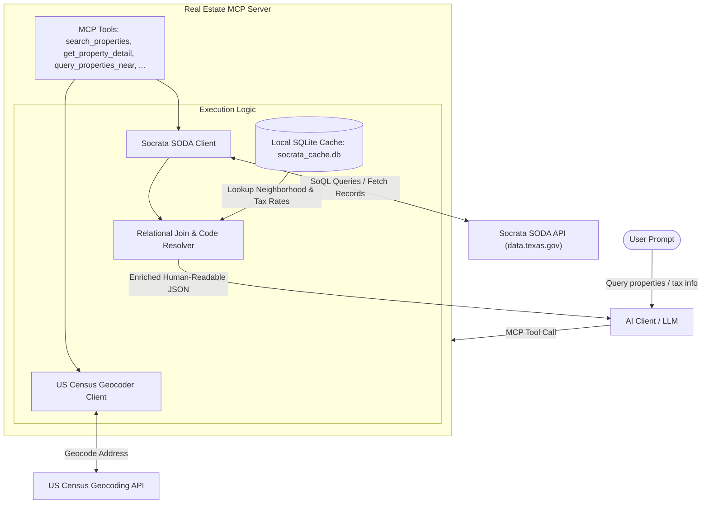

# Socrata Real Estate MCP Server

A high-performance Model Context Protocol (MCP) server for querying real estate property and tax data from the Socrata SODA API (specifically tailored for `data.texas.gov` and Collin County CAD). 

This server solves Socrata's lack of native `JOIN` support by securely caching massive lookup tables (Neighborhoods and Taxing Entities) into a local atomic SQLite database, providing AI assistants with instantly-resolved, human-readable JSON outputs.

## Features & Functionality

The server exposes five AI-ready MCP tools:

1. **`search_properties`**: Search for properties via address, owner name, or zip code. Automatically resolves complex IDs into readable Neighborhood names and Taxing Entity combinations.
2. **`get_property_detail`**: Perform a deep dive into a specific property record using its unique `propid`.
3. **`query_properties_near`**: Translates English addresses into exact coordinates (using the free US Census Geocoder to avoid cloud-IP bans) to verify geospatial locations.
4. **`discover_county_datasets`**: Queries the Socrata Global Catalog (`api.us.socrata.com`) to dynamically discover available datasets by county name.
5. **`refresh_cache`**: On-demand manual rebuild of the local SQLite relational cache.

---

## 🎯 Gap Analysis: What This Server Solves

Unlike generic Socrata MCP servers or direct REST API integrations, this server is specifically engineered to overcome the structural, relational, and geospatial limitations of open data portals:

| Feature / Gap | Raw Socrata API | Standard MCP Servers | This Real Estate MCP Server |
| :--- | :--- | :--- | :--- |
| **Relational Joins (`JOIN`)** | **None.** HTTP SODA has no relational join syntax over REST. | **None.** Standard MCPs can only query one dataset/table at a time. | **Resolved Locally.** Downloads and caches lookup tables (Neighborhoods, Taxing Entities) in a local SQLite database for instant, zero-latency joining. |
| **Geospatial Resolution** | Needs pre-computed coordinates (`lat`/`lon`) for queries like `within_circle`. | Cannot resolve addresses or locations to coordinates. | **Integrated Geocoder.** Resolves standard street addresses to GPS coordinates using the US Census Geocoding API (preventing cloud-IP rate-limiting/blocking). |
| **Code Translation** | Returns raw internal codes (e.g., Neighborhood `1001` or Tax Entity `GCO`). | Returns raw codes directly to the LLM, consuming context and reasoning. | **Human-Readable Outputs.** Translates abstract codes into actual entity names and adjustment values before presenting results to the LLM. |
| **Token Limit Overflow** | Returns raw JSON payloads that can exceed 100MB+ for large queries. | Dumps massive raw JSON payloads directly into the prompt context, causing crashes. | **Intelligent Payload Control.** Cleans and structures data, returning concise summaries and resolving relational fields to keep tokens low. |

---

## 🛠 Installation

1. Navigate to the project directory:
   ```bash
   cd /path/to/mcp-socrata-readonly
   ```
2. Create the Python virtual environment:
   ```bash
   python3 -m venv venv
   ```
3. Install the required dependencies:
   ```bash
   venv/bin/pip install -r requirements.txt
   ```

---

## ⚙️ Configuration

The server is configured using environment variables. You can specify these variables in one of two ways:

1. **MCP Client Config File (`config.json` / `claude_desktop_config.json`)**: **Required for Embedded Mode** (e.g., Claude Desktop, Cursor). Because these host clients spawn the MCP server subprocess from arbitrary system or home working directories, the server's automatic `.env` loader will not locate a project-root `.env` file. Specifying configuration variables directly in the JSON's `env` section ensures they are passed correctly.
2. **Local `.env` File**: **Recommended for Standalone Mode (SSE) and Development**. When running the server from the project directory, you can copy the template provided to create a local `.env` file:
   ```bash
   cp env.template .env
   ```

### Configuration Variables

| Environment Variable | Description | Default / Fallback |
| :--- | :--- | :--- |
| `SOCRATA_APP_TOKEN` | Optional. Your Socrata App Token to bypass public API rate limits (highly recommended for production). | `None` (Public access) |
| `USER_AGENT_EMAIL` | Optional. Email sent in the User-Agent header (required/polite for Nominatim fallbacks or other APIs). | `socrata_mcp_default@example.com` |
| `CACHE_TTL_DAYS` | Optional. The number of days before the local SQLite cache is considered expired. | `7` |

### Client Configuration Example (e.g., `claude_desktop_config.json`):
```json
{
  "mcpServers": {
    "socrata-real-estate": {
      "command": "/path/to/mcp-socrata-readonly/venv/bin/fastmcp",
      "args": ["run", "/path/to/mcp-socrata-readonly/main.py"],
      "env": {
        "SOCRATA_APP_TOKEN": "YOUR_SOCRATA_APP_TOKEN_HERE",
        "USER_AGENT_EMAIL": "your-email@example.com"
      }
    }
  }
}
```

---

## 🚀 Usage Modes

This server leverages `fastmcp` and can be run in **Embedded Mode** (STDIO), **Standalone Mode** (SSE), or **Development Mode**.

### 1. Embedded Mode (STDIO) - Recommended for AI Assistants
In embedded mode, the server communicates with your AI client (like Claude Desktop, Cursor, or Cline) directly through standard input/output. This is the most secure and frictionless way to use the server.

**Configuration for your AI Client (e.g., `claude_desktop_config.json`):**
```json
{
  "mcpServers": {
    "socrata-real-estate": {
      "command": "/path/to/mcp-socrata-readonly/venv/bin/fastmcp",
      "args": ["run", "/path/to/mcp-socrata-readonly/main.py"]
    }
  }
}
```

### 2. Standalone Mode (SSE / HTTP)
If you want to host this MCP server independently, across a network, or expose it to multiple clients simultaneously, you can run it via Server-Sent Events (SSE). 

Start the server on port `8000`:
```bash
venv/bin/fastmcp run main:mcp --transport sse --port 8000
```
* Clients can now connect to this MCP server via `http://localhost:8000/sse`.

### 3. Development Mode (Built-in Web UI)
If you just want to test the tools manually in your web browser without an AI assistant, you can launch the FastMCP Inspector UI.

```bash
venv/bin/fastmcp dev main:mcp
```
* This will spin up a local web server and open a beautiful UI where you can input parameters and test the tools visually.

---

## 🏗 Architecture & Data Flow



---

## 🧪 Running Tests

A complete suite of integration tests is located in the `tests/` directory. You can run all tests using Python's built-in `unittest` module:

```bash
venv/bin/python -m unittest discover -s tests
```

---

## 📦 Packaging & Distribution

This server is fully configured as a standard Python package using `pyproject.toml`. It exposes a global console script `mcp-socrata` so it can be installed and run easily.

### Option A: Install Directly from GitHub
Others can install the server directly from GitHub without publishing to PyPI first:
```bash
pip install git+https://github.com/balamuru/mcp-socrata-readonly.git
```
Then configure it in the client config (e.g., `claude_desktop_config.json`):
```json
{
  "mcpServers": {
    "socrata-real-estate": {
      "command": "mcp-socrata",
      "env": {
        "SOCRATA_APP_TOKEN": "YOUR_SOCRATA_APP_TOKEN"
      }
    }
  }
}
```

### Option B: Build and Publish to PyPI
To publish the package so that others can install it via `pip install mcp-socrata-readonly`:

1. Install build tools:
   ```bash
   pip install --upgrade build twine
   ```
2. Build the package wheel and tarball:
   ```bash
   python -m build
   ```
3. Upload the package to PyPI (requires PyPI credentials):
   ```bash
   python -m twine upload dist/*
   ```

---

## 🗺 Multi-County Support & Caching Behavior

### 1. Collin County Specificity
This MCP server is pre-configured out-of-the-box for **Collin County, TX** (appraisal data, neighborhoods, and tax entities hosted on `data.texas.gov`).

### 2. How to Support Other Counties
To support other counties:
1. Locate the county's appraisal, neighborhood, and entity datasets on Socrata (e.g., Dallas County CAD or Travis County CAD on `data.texas.gov` or a separate portal).
2. Note their Socrata domain (e.g. `data.texas.gov`) and unique 9-character dataset IDs (e.g., `vffy-snc6`).
3. Add the new county configuration to the registry dictionary `COUNTY_REGISTRY` in `registry.py`:
   ```python
   "dallas": {
       "domain": "data.texas.gov",
       "appraisal_dataset": "xxxx-xxxx",
       "neighborhood_dataset": "yyyy-yyyy",
       "entity_dataset": "zzzz-zzzz",
   }
   ```
4. Now, the tools can be invoked with `county="dallas"` (e.g., `search_properties(address="123 Main St", county="dallas")`).

### 3. Concurrent County Access & Cache Collisions
* **Concurrent Execution**: Yes, you can query multiple registered counties concurrently by passing the corresponding `county` parameter in separate tool calls.
* **Cache Collision Warning**: 
  > [!WARNING]
  > The local SQLite cache (`socrata_cache.db`) currently uses the Socrata **domain** (e.g., `data.texas.gov`) as the key for namespaces. If you configure and query multiple counties that are hosted on the **same Socrata domain** (e.g., Collin County and Dallas County both on `data.texas.gov`), their lookup caches (Neighborhood codes and Taxing Entity rates) will collide and overwrite each other in the database.
  > 
  > **To run multiple counties on the same domain concurrently without collisions**, we would need to update the database schema in `database.py` and the lookup logic in `main.py` to namespace records by Socrata **`dataset_id`** (which is globally unique) instead of `domain`.

---

## Architecture Notes
* **Data Fetching:** SODA pagination limits are cleanly handled up to 50,000 records per page. `urllib3` retry logic protects against Socrata `429` (Rate Limit) and `500` HTTP exceptions.
* **Geocoding:** Defaults to the **US Census Geocoder** API. OpenStreetMap Nominatim is notoriously strict with blocking cloud datacenter IPs (403 Forbidden errors). The Census API requires no keys and handles cloud traffic gracefully.
